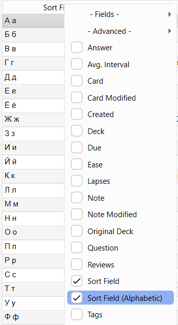

This Anki add-on adds a new browser column that allows sorting by the sort field in a more alphabetic order than the default one for non-latin text.

See the following posts for details about the problem the add-on tries to solve:

https://forums.ankiweb.net/t/sorting-should-produce-a-more-alphabetical-order/21621

https://forums.ankiweb.net/t/sort-field-in-alphabetic-order-problem/28687

## Supported versions

The add-on should work out of the box on Anki 2.1.45+. For older versions, it relies on the [Advanced Browser](https://ankiweb.net/shared/info/874215009) add-on to add the browser column, so you need it installed.

## Download

You can download the add-on from AnkiWeb: [967882190](https://ankiweb.net/shared/info/967882190)

## Technical details

By default, the add-on uses the [Unicode collation algorithm](https://en.wikipedia.org/wiki/Unicode_collation_algorithm) (via [pyuca](https://github.com/jtauber/pyuca)) for sorting.

The add-on also supports the `unicase` SQLite collation added by Anki, which does Unicode case-folding using the [unicase crate](https://crates.io/crates/unicase). You can enable it by changing the `COLLATION` enum variable in the code.

## Support & feature requests

Please post any questions, bug reports, or feature requests in the [support page](https://forums.ankiweb.net/c/add-ons/11) or the [issue tracker](https://github.com/abdnh/anki-browser-alphabetic-sort/issues).

If you want priority support for your feature/help request, I'm available for hire.
You can get in touch from the aforementioned pages, via [email](mailto:abdo@abdnh.net) or on [Fiverr](https://www.fiverr.com/abd_nh).

## Support me

Consider supporting me if you like my work:

I'm also available for freelance add-on development on Fiverr:

